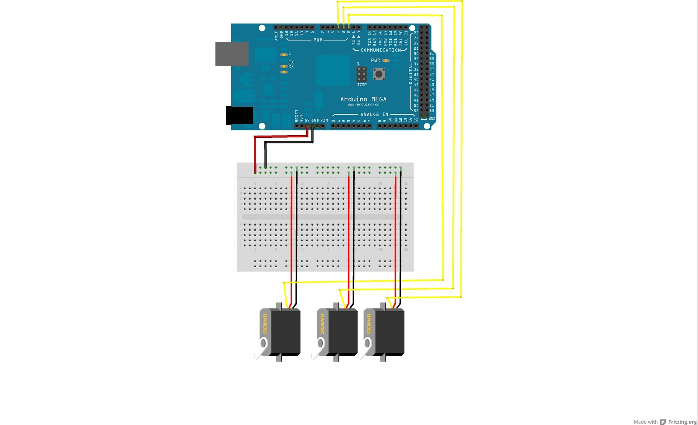

# Leap-motion-controlled-Helicopter

Welcome to the Leap-motion-controlled-Helicopter wiki! Here we control a syma s102 helicopter using leap motion and hand movements. 

To run this app, node.js is required with additional plugins of ws ( for the leap motion ) and johnny five to allow the Arduino to interpret the javascript code. Control.js is the main file where all code is present, rest are supporting libraries.

The leap motion translates hand motions into servo movements for the Arduino to control the helicopter.  The standard firmata plus is uploaded on the arduino and then connected to with a serial cable to transfer the leap values. 

Addtionally the arduino is set up as the diagram below, with connections to three servos.

 
Credits to http://marc-tetrapod.blogspot.sg/2012/10/arduino-ssc-32-servo.html for the image.

